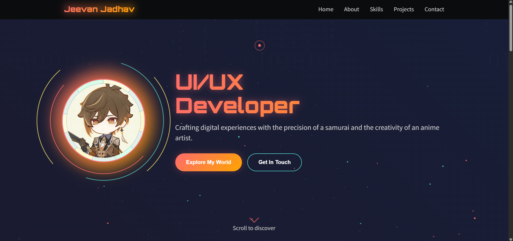
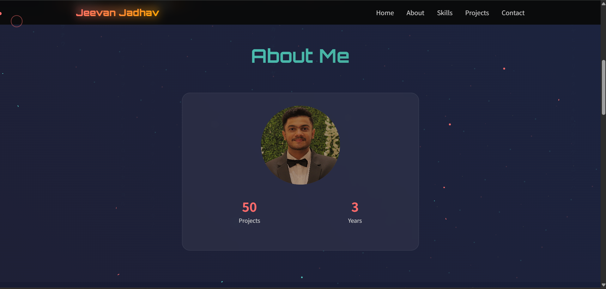
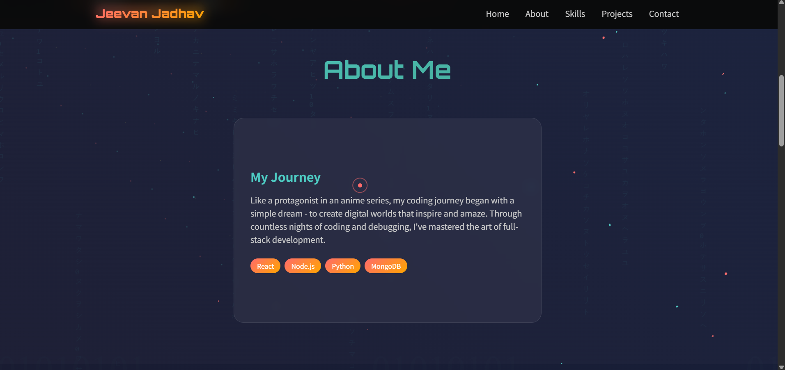

# Portfolio Template 8

A modern, image-rich portfolio template built with HTML, CSS, and JavaScript—ideal for personal or creative showcases.

##  Demo





---

## Features

- **Elegant, responsive design** using HTML5 and CSS3  
- **Interactive elements** (animations, dynamic behavior) via JavaScript (`script8.js`)  
- **Visual assets** included—cover/background images like `bg.jpg`, and personal/project shots (`Jeevan.jpg`, `Zhongli.jpg`)  
- **Easy customization**:
  - Modify content directly in `Portfolio8.html`
  - Adjust layout and styles in `style8.css`
  - Enhance interactivity via `script8.js`

---

## Getting Started

### Prerequisites

A modern web browser (e.g., Chrome, Firefox, Safari).

### Steps to Run Locally

1. **Clone the repository:**
   ```bash
   git clone https://github.com/NOVA0206/Portfolio-Template-8.git

2. **Navigate to the project folder:**

   ```bash
   cd Portfolio-Template-8
   ```
3. **Open `Portfolio8.html`** in your browser to view the template in action.

## Customization Guide

| File              | Purpose                               | Customizable Elements                                    |
| ----------------- | ------------------------------------- | -------------------------------------------------------- |
| `Portfolio8.html` | Structure and content                 | Text, sections, image paths                              |
| `style8.css`      | Visual styling                        | Colors, fonts, layout                                    |
| `script8.js`      | Interactive behaviors                 | Animations, scroll effects, event logic                  |

TIP: Use high-resolution images optimized for web to maintain performance and aesthetic quality.

---

## License

This project is released under the **MIT License**. You’re free to use, modify, and distribute this template—even commercially. Attribution is appreciated but not required. See the `LICENSE` file for full details.

---

## Credits

* Developed by **NOVA0206**
* Designed for portfolio presentation with images and interactivity

---

## Contact

Repo Owner: **NOVA0206** 

Gmail: **jeevanj020604@gmail.com** 

Name: **Jeevan Jadhav** 

---
